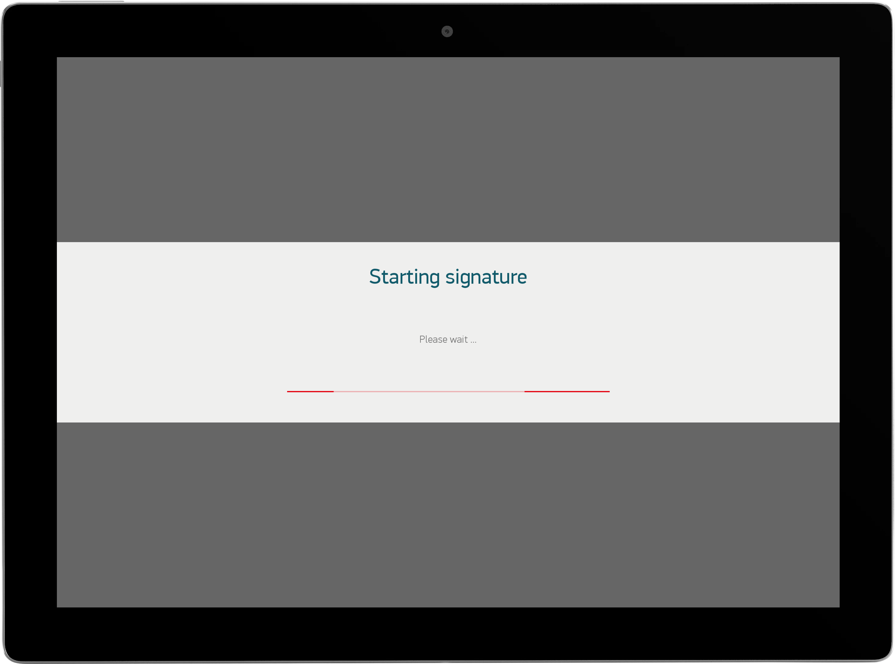

# Core

## Table of Contents

1. [Gradle Dependency](#gradle-dependency)
2. [Basics](#basics)
3. [ENSettings](#ensettings)
4. [ENLogger](#enlogger)
5. [Initialization Callback](#initialization-callback)
6. [ENAuth](#enauth)
7. [ENDialog](#endialog)
8. [Utilities](#utilities)
9. [ENMobileSDKConfig](#ENMobileSDKConfig)
10. [Theming](#Theming)
12. [InternalEventDriven](#InternalEventDriven)
13. [ENMobileSdkActions](#enmobilesdkactions)
14. [ENMobileSdkException](#ENMobileSdkException)

## Gradle Dependency


The `core` module contains everything you need to get started with the library. It contains all core and:

* utilities
* logger
* enauth
* endialog
* ensettings

```gradle
dependencies {
  implementation 'com.euronovate.mobilesdk:core:1.0.1'
}
```

## Basics

Here's a very basic example of inizialization of ENMobileSDK. You have to do this operation once time because we keep istance of each modules.

```kotlin
ENMobileSDK.Builder()
     .with(context = applicationContext)
     .with(settings = ENSettings.Builder().build())
     .with(logger = ENLogger.Builder()
            .with(ENLoggerConfig(true,ENLogger.VERBOSE)).build())
     .with(initializationCallback = this@MainActivity)
     .with(authConfig = ENAuthConfig(licenseKey = "your license key of enauth", serverUrl= "enauth server url"))
     .with(ENMobileSdkConfig(certificateOwnerInfo = ENCertificateOwnerInfo(),networkConfig = ENNetworkConfig(skipSSL = true))
     .with(theme = ENDefaultTheme())
     .build()
```
You have to **respect** *.with* order like in above example.

## ENSettings

The `settings` class is used to change runtime and save in persistance area all network parameters in enmobilesdk and each submodules config.

This is a simple snippet

```kotlin
.with(settings = ENSettings.Builder()
	 .with(context = applicationContext)
	 .build())

```
Only `context` is required. After inizialization you can use

### ENSettings Actions

**Open Settings programmatically**

```kotlin
ENSettings.getInstance().start()

```


**GetValue** 
saved in settings (String, Boolean at this moment):

```kotlin
ENSettings.getInstance().getValue("key", defaultValue)

```
**Add custom settings editable**:

```kotlin
ENSettings.getInstance().addSettings("section name", ENSettingsConf("key","label name", ENSettingsConfType.input, valueFinal))
```

`ENSettingsConfType` is an enum with these options:

* *input*
* *switch*
* *label*

**Clear settings / Reset**

We have added a menu item on top , with a label "Reset" if it is tapped sdk will reset all settings to default value. You can also reset programmatically with this:

```kotlin
ENSettings.getInstance().clearSettings()
```

After that you have to restartApp, if you want you can use this method:

```kotlin
ENGenericUtils.restartApp(your activity)
```

## ENLogger

The `logger`class is used to trace exception,debug info, api or anything. All logs are written in different file *.txt* with name based on current day with this format: *dd/MM/yyyy*

Snippet example:

```kotlin
.with(logger = ENLogger.Builder()
	.with(applicationContext)
	.with(ENLoggerConfig(debuggable = true, logLevel = ENLogger.VERBOSE, logServerConfig = ENLogServerConfig(baseUrl = null, null)))
	.build()
)
```
You have to **respect** *.with* order like in above example.

*applicationContext* is required
*loggerConfig* is required is based on ENLoggerConfig class

```kotlin
ENLoggerConfig(var debuggable: Boolean, @LogLevel var logLevel: Int,
			   var env: String, var logServerConfig: ENLogServerConfig?=null))
```
* **debuggable**: you can enable / disable logging
* **loglevel**: is an enum like android native (VERBOSE,ERROR,DEBUG) with this you can choice level of logging
* **env**: you can specifiy your env example: PROD,DEV 
* **logServerConfig**: is optional and is used to comunicate with LOGSERVER in Backend. 
This is the constructor:

```kotlin
ENLogServerConfig(baseUrl: String? = null, licenseCode: String? = null)
```

### ENLogger Actions

**Log an error**

```kotlin
ENLogger.getInstance().e(TAG, "[${javaClass.simpleName}]: ${Exception().stackTrace[0].lineNumber} $message",exception)
```

**Log an info message**

```kotlin
ENLogger.getInstance().i(TAG, "[${javaClass.simpleName}]: " + "${Exception().stackTrace[0].lineNumber} ${message}")
```

**Log before init (app start)**

You have to call this method
```kotlin
fun logStartingApplication(context: Context,appName: String,activityName: String, versionName: String,versionCode: String, env: String){
```
this is an example:

```kotlin
ENLogger.logStartingApplication(context = this,activityName = "MainActivity", appName = getString(R.string.app_name), versionName = BuildConfig.VERSION_NAME, versionCode = "${BuildConfig.VERSION_CODE}", env = BuildConfig.ENV)
```

**Send log files after compression in .zip**

```kotlin
ENLogger.getInstance().sendLogEmailIntent("app name",context)
```

**Return only path of zip including logs:**

```kotlin
ENLogger.getInstance().zipLogFile()
```

## Initialization Callback

This callback is required and it allow to notify user when all'sdks are initialized and ENAuth activated all product.

```kotlin
.with(initializationCallback: ENMobileInitializationCallback<String>)
```

ENMobileInitializationCallback is a class that contains:

```kotlin
fun didGetResponse(response: ENMobileSDKResponse<String>?) {
        when (response) {
            is ENMobileSDKResponse.error -> {
                //handle error with response.error
            }
            is ENMobileSDKResponse.success -> {
                //your code after initialization
            }
        }
    }
```

## ENAuth

ENAuth is a fundamental class used to activate and checking license of each submodules.
You can configure ENAuth in two ways:
***with jwt*** for example to use in offline mode

```kotlin
.with(authConfig = ENAuthConfig(licenseKey = "yourLicenseKey",
                serverUrl = "yourUrl",
                jwt = "yourJwt"))
```

or online mode with licenseKey and serverUrl:

```kotlin
.with(authConfig = ENAuthConfig(licenseKey = "yourLicenseKey", serverUrl = "yourUrl"))
```

If you haven't serverUrl and licenseKey or Jwt you can contact [customer[dot]sales[at]euronovate[dot]com](mailto:customer.sales@euronovate.com) to request a trial. **Without their sdk won't initialized** so if you try to call an instance of a modules you will get a **crash**

There is other parameter that you can pass via constructor of ENAuthConfig:

```kotlin
ENAuthConfig(
    var licenseKey: String,
    var serverUrl: String,
    var username: String? = null,
    var password: String? = null,
    var productId: String? = "MAPAND:*",
    var jwt: String? = null,
)
```

for example you can request an activation for onyl a specific product, or you can pass username e password.

Exist a class to handle ENAuth Exception. It is called `ENAuthException`

### ENAuthException

We have default exception in core, but there are other type specific to ENAuthException:

* **licenseVerificationWrongDeviceId** is returned when your jwt contains a wrong device uuid different of your current device.
* **someProductsHaveProblems**  your jwt contains a different list of product(module) that you are trying to activate.
* **noProductToActivate** is returned when there isn't product(module) available to be activate.
* **licenseJwtEmpty** your jwt is empty or not valid.

## ENDialog

ENDialog is a class that allows to prompt a new dialog. There is a differente type of dialog. All types they are included in enum: `ENDialogType`

```kotlin
enum class ENDialogType {
    positive,
    negative,
    warning,
    progress,
    question,
    list,  
	input
}
```
You can prompt a dialog with:

```kotlin
ENDialog.getInstance().dialog(activity: Activity, 
	dialogType: ENDialogType, 
	listener: ENDialogInterface?=null, 
	dialogTextConfig: ENDialogTextConfig?=null
)
```

listener is a class like a callback that handle onClick or/and onLongClick of allUI:

```kotlin
override fun onClick(view: View, dialogItem: ENDialogUItem, dialog: Dialog) {
       super.onClick(view, dialogItem, dialog)
       when(dialogItem){
       	ENDialogUItem.buttonRight ->{
                   
       	}
       	else->{} 
       }
}
```

ENDialogUItem is an enum that contains all UI Item in dialog:

```kotlin
enum class ENDialogUItem {
    buttonLeft,
    buttonRight,
    title,
    subTitle,
    iconDx
}
```

To Customize text inside a dialog.

```kotlin
ENDialogTextConfig( var title: String?= null, var content: String?=null,
var rightButton: String?=null, var leftButton: String?=null)
```


**ProgressDialog (Indeterminate)**

```kotlin
ENDialog.getInstance().dialog(ENApplication.currentActivity()!!,dialogType = ENDialogType.progress,
	dialogTextConfig = ENDialogTextConfig(title= "title", content= "content"))
```




**List Dialog**

Exist a dialog that you can used to show a set of list data, this is an example:


```kotlin
ENDialog.getInstance().dialog(activity,dialogType = ENDialogType.list,  
    listener = object: ENDialogInterface {  
        override fun onItemSelected(view: View, dialogItem: ENDialogUItem, dialog: Dialog, position: Int) {  
            super.onItemSelected(view, dialogItem, dialog, position)  
           
        }  
        override fun onClick(view: View, dialogItem: ENDialogUItem, dialog: Dialog) {  
            super.onClick(view, dialogItem, dialog)  
            when(dialogItem){ENDialogUItem.buttonLeft->{ dialog.dismiss() } else -> {} }  
        }  
    },dialogTextConfig = ENDialogTextConfig(title="title", content = "description", leftButton = "left button", dataList = youArrayList)).show()
```

**Input dialog**


We have created an input dialog, implementations is very simple:

```kotlin
ENDialog.getInstance().dialog(activity = activity,dialogType = ENDialogType.input,  
    listener = object: ENDialogInterface {  
        override fun onInput(  
            view: View,  
            dialogItem: ENDialogUItem,  
            dialog: Dialog,  
            text: String  
        ) {  
            super.onInput(view, dialogItem, dialog, text)  
           
            }  
        }  
        override fun onClick(view: View, dialogItem: ENDialogUItem, dialog: Dialog) {  
            super.onClick(view, dialogItem, dialog)  
            when(dialogItem){ENDialogUItem.buttonLeft->{ dialog.dismiss() }else -> {}  
            }  
        }  
    },dialogTextConfig = ENDialogTextConfig(title= "title",  
        content = "content", leftButton = "left",rightButton = "right")).show()
```
### ENDialog Actions

After initialized dialog you can use all method like Dialog Android

[https://developer.android.com/reference/android/app/AlertDialog](https://developer.android.com/reference/android/app/AlertDialog)

for example `.show()` `.dismiss()`


## Utilities

Is a package that contains a set of class Utils. It is initialized automatically with core build.
You can call all static method from your, we use their inside the core. 
> This is the list of Files utils:

* `ENAnimationUtils`
* `ENBase64Utils`
* `ENBitmapUtils`
* `ENBlurUtils`
* `ENCanvasUtils`
* `ENColorUtils`
* `ENCryptoUtils`
* `ENDateUtils`
* `ENDeviceUtils`
* `ENFileUtils`
* `ENGenericUtils`
* `ENHomonymsUtils`
* `ENImageUtils`
* `ENJSONUtils`
* `ENLanguageUtils`
* `ENNetworkUtils`
* `ENResourcesUtils`
* `ENStringUtils`
* `ENTypefaceUtils`
* `ENViewUtils`
* `ENWebViewUtils`

It also contain an `ENApplication` and `ENActivitityLifecycleCallback` they are necessary with **ENPubSub** modules

You have to set in manifest ENApplication like this:

```kotlin
<application
...
android:name=".ENApplication"
```

or you can extend your application .kt like this:

```kotlin
class MainApplication : ENApplication(){
    ...
}
```

## ENMobileSDKConfig

As you can guess from the builder source code, you have the possibility to configure some parameters (some are optional other not) of the "core"

The Constructor is:
```kotlin
class ENMobileSdkConfig(  
    var enableSignatureOverwrite: Boolean?=true,  
    var keepScreenAlwaysOn:Boolean?=false,  
   .var languageConfig: ENLanguageConfig?=null,  
    var certificateOwnerInfo: ENCertificateOwnerInfo? = null,  
    var certificateIntegrity: String?=null,  
    var networkConfig: ENNetworkConfig = ENNetworkConfig()  
)
```

and this is an example:

```kotlin
.with(mobileSdkConfig = ENMobileSdkConfig(
		    networkConfig = ENNetworkConfig(skipSSL = true,  
			    OAuth2Config = null,
			    customHeaders = hashMapOf("key1" to "val11")
			    customBody = CustomBody(),  
				customHeader = CustomHeader()
		    ),
            certificateOwnerInfo = ENCertificateOwnerInfo(),
            certificateIntegrity = "base64ofpemwithprivatekey",
            languageConfig = ENLanguageConfig(selectorVisible = true,languageEnabled = arrayListOf(ENLanguageType.en, ENLanguageType.el))
))
```
* `languageConfig` is an object that allow to enable/disable language picker in ENDigitalSignage/ENViewer this is the contructor
  ```kotlin
  class ENLanguageConfig(  
     var languageEnabled: ArrayList<ENLanguageType>? = null,  
     var selectorVisible: Boolean? = null  
)
  ```
You can specify a list of language will be avaiable, and consider the first of the list will be setted like default for the first time.
* `networkConfig` is an object that contains all global variable used in network (example: in api) this is the constructor:

```kotlin
class ENNetworkConfig(  
    var skipSSL: Boolean = false,  
    var OAuth2Config: ENOAuth2Config?= null,  
    var customHeader: ENCustomHeader? = null,  
	var customBody: ENCustomBody? = null
)
```
Inside the NetworkConfig you can configure:
* `skipSSL` allow to ignore https not valid or expired if a true
* `customerHeader` is optional, if it is present it will allow to add custom parameter in each request Headers. You have to create a class that extend:  `ENCustomHeader` like this:
```kotlin
class MyCustomHeader (  
    @SerializedName("header")  
    var header: String = "value"  
) : ENCustomHeader()
```
**All parameters must be only string.**

Exist a method called `toJSON` you can override it and handle trasformation, idem with method `toHashMap`

* `customBody` is optional, if it is present it will allow to add custom json/parameter in each request. You have to create a class that extend:  `ENCustomBody` like this:

```kotlin
class MyCustomBody : ENCustomBody()(    
 @SerializedName("name")  
    var name: String = "Euronovate",  
 @SerializedName("id")  
    var id: String = UUID.randomUUID().toString()  
)
```

Exist a method called `toJSON` you can override it and handle trasformation.

* `OAuth2Config` if you need to enable OAuth2 for each api request you can configure it with this class.

```kotlin
 ENOAuth2Config(
    var url: String,
    var bodyParameters: FormBody? = null,
    var bodyJson: JSONObject? = null,
    var headerParameters: HashMap<String, String>? = null,
)
```
You have to pass `url` compulsory. 
`bodyParameters` or `bodyJson` or `headerParameters` are optionally and you can configure if you need.

Response must be like this:

```kotlin
class ENOAuth2Response(
    @SerializedName("access_token")
    var accessToken: String?,
    @SerializedName("expires_in")
    var expiresIn: Long?
)
```

If OAuth2 is configured, in each network request will be an `Authorization Bearer` with `accessToken` that you have provided to us.

`accessToken` will be store in shared preferences (crypted) to avoid request -> one token for each network request, we consider `expiresIn` (seconds) + currentDate to check if token is still valid.

At the moment we request automatically a new token if we receive 401 once time.

* `certificateOwner` allow user to customize entity of certificate autogenerated during applying signature in field. If `certificateIntegrity` was set this parameter won't used. The constructor is:

```kotlin
ENCertificateOwnerInfo (
    var organization: String? = "Euronovate SA",
    var countryCode: String? = "Switzerland",
    var localityName: String? = "Lugano",
    var commonName: String? = "Android SDK",
)
```

* `certificateIntegrity` must contains base64 of pem with privateKey and certificate. If it is set, the certificate generation operation will be skipped during the applying of the first signature in the document
* `languageConfig` allow user to set a list of avaiable language in app, based on our enum `ENLanguageType` 
   In the specific config you can also decide if enable or not languagePicker in`ENViewer` and/or `ENDigitalSignage`
* `enableSignatureOverwrite` is a flag that allow to overwrite a signature in a document
* `keepScreenAlwaysOn` is a flag that allow to keep screen of device always active without go in standby.

## Theming

Each user can customize some ui parts of sdk at this moment:


```kotlin
abstract class ENTheme {
    abstract fun signatureBoxTheme(): ENSignatureBoxTheme
    abstract fun dialogsTheme(): ENDialogsTheme
    abstract fun digitalSignageTheme(): ENDigitalSignageTheme
	abstract fun presenterTheme(): ENPresenterTheme
}
```

In the specific sub modules (libraries) we explained how to customize these themes:
  - `ENSignatureBox`
  - `ENDigitalSignage`
  - `ENPresenterTheme
  

Instead  if you want customize `ENDialogsTheme` you will follow these examples:

```kotlin
class ENDefaultDialogsTheme: ENDialogsTheme(){
    override fun positiveDialog(): ENDialogConfig {
        val context = ENMobileSDK.getInstance().applicationContext
        return ENDialogConfig(title = ENUIViewStyle(textSize = 33f,textColor = context.getColor(R.color.lightblue),textTypeface = font().regular()),
            subTitle = ENUIViewStyle(textSize = 25f,textColor = context.getColor(R.color.whitelightsubtitle),textTypeface = font().light()),
            bg= ENUIViewStyle(bgColor = context.getColor(R.color.bgcolordialog)),
            rightButton = ENUIViewStyle(textSize = 25f,textColor = context.getColor(R.color.yellow),textTypeface = font().regular(),borderColor = context.getColor(
                R.color.lightblue),borderWidth = 1),
            rightBand = ENUIViewStyle(bgColor = context.getColor(R.color.lightblue)),
            rightIcon = ENUIViewStyle(srcImage = R.drawable.ic_done,tintColor = context.getColor(R.color.white))
        )
    }

    override fun negativeDialog(): ENDialogConfig {
        val context = ENMobileSDK.getInstance().applicationContext
        return ENDialogConfig(title = ENUIViewStyle(textSize = 33f,textColor = context.getColor(R.color.lightblue),textTypeface =  font().regular()),
            subTitle = ENUIViewStyle(textSize = 25f,textColor = context.getColor(R.color.whitelightsubtitle),textTypeface =  font().light()),
            bg= ENUIViewStyle(bgColor = context.getColor(R.color.bgcolordialog)),
            rightButton = ENUIViewStyle(textSize = 25f,textColor = context.getColor(R.color.yellow),textTypeface = font().regular(),borderColor = context.getColor(
                R.color.lightblue),borderWidth = 1),
            rightBand = ENUIViewStyle(bgColor = context.getColor(R.color.redsemidark)),
            rightIcon = ENUIViewStyle(srcImage = R.drawable.ic_error,tintColor = context.getColor(R.color.white))
        )
    }
    override fun warningDialog(): ENDialogConfig {
        val context = ENMobileSDK.getInstance().applicationContext
        return ENDialogConfig(title = ENUIViewStyle(textSize = 33f,textColor = context.getColor(R.color.lightblue),textTypeface = font().regular()),
            subTitle = ENUIViewStyle(textSize = 25f,textColor = context.getColor(R.color.whitelightsubtitle),textTypeface = font().light()),
            bg= ENUIViewStyle(bgColor = context.getColor(R.color.bgcolordialog)),
            rightButton = ENUIViewStyle(textSize = 25f,textColor = context.getColor(R.color.yellow),textTypeface = font().regular(),
                borderColor = context.getColor(R.color.lightblue),borderWidth = 1), rightBand = ENUIViewStyle(bgColor = context.getColor(R.color.yellow)),
            rightIcon = ENUIViewStyle(srcImage = R.drawable.ic_warning,tintColor = context.getColor(R.color.titletextprogressdialog))
        )
    }

    override fun progressDialog(): ENDialogConfig {
        val context = ENMobileSDK.getInstance().applicationContext
        return ENDialogConfig(title = ENUIViewStyle(textSize = 35f,textColor = context.getColor(R.color.titletextprogressdialog),textTypeface = font().regular()),
            subTitle = ENUIViewStyle(textSize = 17f,textColor = context.getColor(R.color.gray),textTypeface = font().light()),
            bg= ENUIViewStyle(bgColor = context.getColor(R.color.bgcolordialogprogress),tintColor = context.getColor(R.color.white))
        )
    }

    override fun questionDialog(): ENDialogConfig {
        val context = ENMobileSDK.getInstance().applicationContext
        return ENDialogConfig(title = ENUIViewStyle(textSize = 33f,textColor = context.getColor(R.color.lightblue),textTypeface =  font().regular()),
            subTitle = ENUIViewStyle(textSize = 25f,textColor = context.getColor(R.color.whitelightsubtitle),textTypeface = font().light()),
            bg= ENUIViewStyle(bgColor = context.getColor(R.color.bgcolordialog)),
            rightButton = ENUIViewStyle(textSize = 25f,textColor = context.getColor(R.color.yellow),textTypeface = font().regular(),borderColor = context.getColor(R.color.lightblue),borderWidth = 1),
            rightBand = ENUIViewStyle(bgColor = context.getColor(R.color.lightblue)),
            rightIcon = ENUIViewStyle(srcImage = R.drawable.ic_question,tintColor = context.getColor(R.color.white)),
            leftButton =  ENUIViewStyle(textSize = 25f,textColor = context.getColor(R.color.whitelightsubtitle), textTypeface = font().regular(),borderColor = context.getColor(R.color.lightblue),borderWidth = 1)
        )
    }
    
	override fun inputDialog(): ENDialogConfig {  
	    val context = ENMobileSDK.getInstance().applicationContext  
	    return ENDialogConfig(title = ENUIViewStyle(textSize = 33f,textColor = context.getColor(R.color.white),textTypeface =  font().regular()),  
	        subTitle = ENUIViewStyle(textSize = 25f,textColor = context.getColor(R.color.whitelightsubtitle),textTypeface = font().light()),  
	        bg= ENUIViewStyle(bgColor = context.getColor(R.color.bgcolordialog)),  
	        input = ENUIViewStyle(textSize = 25f,textColor = context.getColor(R.color.white),textTypeface = font().regular(),borderColor = context.getColor(R.color.bguserinfosignaturebox),borderWidth = 1),  
	        rightButton = ENUIViewStyle(textSize = 25f,textColor = context.getColor(R.color.white),textTypeface = font().regular(),bgColor = context.getColor(R.color.bguserinfosignaturebox),borderColor = context.getColor(R.color.bguserinfosignaturebox),borderWidth = 1),  
	        rightBand = ENUIViewStyle(bgColor = context.getColor(R.color.bguserinfosignaturebox)),  
	        rightIcon = ENUIViewStyle(srcImage = R.drawable.ic_question,tintColor = context.getColor(R.color.white)),  
	        leftButton =  ENUIViewStyle(textSize = 25f,textColor = context.getColor(R.color.whitelightsubtitle), textTypeface = font().regular(),borderColor = context.getColor(R.color.white),borderWidth = 1)  
	    )  
	}  
	  
	override fun listDialog(): ENDialogConfig {  
	    val context = ENMobileSDK.getInstance().applicationContext  
	    return ENDialogConfig(title = ENUIViewStyle(textSize = 33f,textColor = context.getColor(R.color.white),textTypeface =  font().regular()),  
	        subTitle = ENUIViewStyle(textSize = 25f,textColor = context.getColor(R.color.whitelightsubtitle),textTypeface = font().light()),  
	        bg= ENUIViewStyle(bgColor = context.getColor(R.color.bgcolordialog)),  
	        rightBand = ENUIViewStyle(bgColor = context.getColor(R.color.bguserinfosignaturebox)),  
	        rightIcon = ENUIViewStyle(srcImage = R.drawable.ic_ballot_light,tintColor = context.getColor(R.color.white)),  
	        titleRowList =  ENUIViewStyle(textSize = 25f,textColor = context.getColor(R.color.whitelightsubtitle), textTypeface = font().bold()),  
	        subTitleRowList =  ENUIViewStyle(textSize = 25f,textColor = context.getColor(R.color.whitelightsubtitle), textTypeface = font().regular()),  
	        leftButton =  ENUIViewStyle(textSize = 25f,textColor = context.getColor(R.color.whitelightsubtitle), textTypeface = font().regular(),borderColor = context.getColor(R.color.white),borderWidth = 1)  
	    )  
	}

    override fun font(): ENFont {
        return ENDefaultFont()
    }
}

```
  - `positiveDialog`
  - `negativeDialog`
  - `warningDialog
  - `progressDialog`
  - `questionDialog`
  - `inputDialog`
  - `listDialog`

You can also personalize Typeface with `font` function, you have to override it like this:

```kotlin
class ENDefaultFont: ENFont(){
    override fun light(): Typeface {
        return ResourcesCompat.getFont(ENMobileSDK.getInstance().applicationContext, R.font.font_ttf)!!
    }
    override fun medium(): Typeface {
        return ResourcesCompat.getFont(ENMobileSDK.getInstance().applicationContext, R.font.font_ttf)!!
    }
    override fun regular(): Typeface {
        return ResourcesCompat.getFont(ENMobileSDK.getInstance().applicationContext, R.font.font_ttf)!!
    }
    override fun bold(): Typeface {
        return ResourcesCompat.getFont(ENMobileSDK.getInstance().applicationContext, R.font.font_ttf)!!
    }
}
```

## InternalEventDriven

There is an EventDriven inside a mobileSdk, at this moment we have these events:
```kotlin
enum class ENEventType {
    appForegrounded, -> when app is put in foreground
    appBackgrounded, -> when app is put in bg 
    coreInitialized, -> when ENMobileSdk finished initialization
    signDocument, -> when receive an event to sign a document
    viewDocument, -> when receive a request to open document in only read mode.
	viewerDidClose -> when user closed viewer(abort,confirm,exit) we also return a guid or path with document status
}
```

You can `subscribe / unsubscribe` or `emit` to their.

**Subscription**

```kotlin
ENMobileSDK.subscribeEvent(ENEventCallback(event ...) { it (is Any)
	...your code when you receive message
})
```
**Unsubscription**

```kotlin
ENMobileSDK.unSubscribeEvent(ENEventCallback..)
```
**Emit Event**

You can emite event to a specific event and pass your custom data, for example:

```kotlin
ENMobileSDK.emitEvent(ENEventType.signDocument,StartSignDTO("guid"))
```

## ENMobileSdkActions

There is a list of public method that aren't included in (settings,event driven ecc..)

**getLanguage**

```kotlin
ENMobileSDK.getInstance().getLanguage()
```
This method return current `Locale` selected in application (not based on system language). 


**setLanguage**

```kotlin
ENMobileSDK.getInstance().setLanguage(resources!!.configuration!!.locales.get(0))
```
With this method you can overwrite current language in app. After this you have to restart current activity at this moment we don't use automatic reaction of changing programmatically.

**getResourcesLocalized**

If you want to get context already localized you will cal this method and your work will simple.

```kotlin
ENMobileSDK.getInstance().getResourcesLocalized()
```

For example: if you need to update label with correct language you can use this.


## ENMobileSdkException

There is a set of exception specific used in core and submodules:

* **sdkNotInitialized** this is error is returned when there is an error with initialization.
* **missingParameterOfInitMobileSdk** is returned when you didn't follow .with order or you didn't pass parameter. Together with the error we will return the missing field type.
* **genericError** is returned when we didn't recognize error, in certain case we use it but we specify reason.
* **serverException** is returned when server of your baseurl isn't unreachable
* **noInternetConnection** is returned when you have disabled wifi or mobile. You will receive this error after api request.
* **errorObtainOAuth2Token** if you activated OAuth2, it is return when we receive an error from OAuth2 provider.
