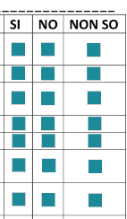
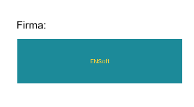

# ENPresenter

## Table of Contents

- [ENPresenter](#enpresenter)
  - [Table of Contents](#table-of-contents)
  - [Gradle Dependency](#gradle-dependency)
  - [Basics](#basics)
  - [ENPresenterActions](#enpresenteractions)
  - [ENPresenterTheme](#enpresentertheme)

## Gradle Dependency


The `presenter` module contains only a template used by `viewer` to render document. It is customized based on client.

```gradle
dependencies {
    implementation "com.euronovate.presenter:presenter:1.3.8"
}
```
## Basics

You shouldn't do anything because presenter is automatically built on `ENViewer` builder.

Layout color,theme are automatically based on clientName, returned from `ENAuth`after **licenseKey** or **Jwt** check

## ENPresenterActions

```kotlin
ENPresenter.getInstance().pathPdfJs : String
```
By this method you can obtain a path of layout/theme of viewer

## ENPresenterTheme

You can initialize your ENDefaultPresenterTheme with this code:

```kotlin
class ENDefaultPresenterTheme: ENPresenterTheme(){  
    override fun checkBoxViewStyle(): ENUIViewStyle {  
        val context = ENMobileSDK.getInstance().applicationContext  
 return ENUIViewStyle(textColor = context.getColor(R.color.yellow),  
 bgColor = context.getColor(R.color.bguserinfosignaturebox))  
    }  
  
    override fun textBoxViewStyle(): ENUIViewStyle {  
        val context = ENMobileSDK.getInstance().applicationContext  
 return ENUIViewStyle(textColor = context.getColor(R.color.yellow),  
 bgColor = context.getColor(R.color.bguserinfosignaturebox))  
    }  
  
    override fun signatureViewStyle(): ENUIViewStyle {  
        val context = ENMobileSDK.getInstance().applicationContext  
 return ENUIViewStyle(textColor = context.getColor(R.color.yellow),   
bgColor = context.getColor(R.color.bguserinfosignaturebox))  
    }  
}
```

At this moment we left possibility to customize these acrofields type:

-checkbox style `checkBoxViewStyle`

-textbox style: `textBoxViewStyle`

-signature style: `signatureViewStyle`



