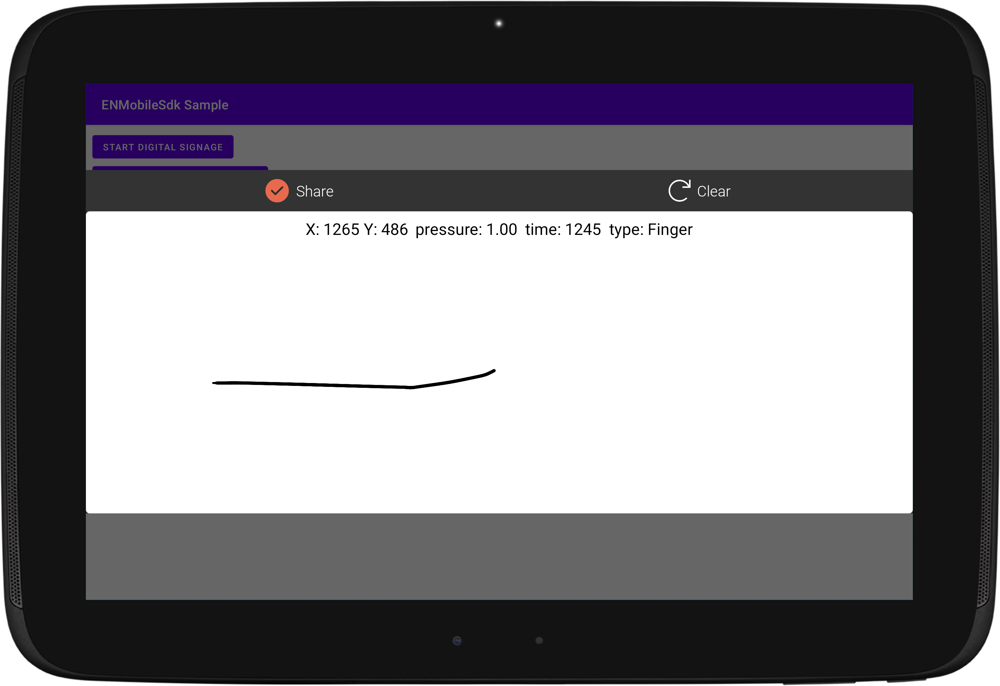

# ENSignatureBox

## Table of Contents
1. [Gradle Dependency](#gradle-dependency)
2. [Basics](#basics)
3. [ENSignatureBoxConfig](#ENSignatureBoxConfig)
4. [ENSignatureBoxActions](#ENSignatureBoxActions)
5. [ENSignatureBoxTheme](#ENSignatureBoxTheme)

## Gradle Dependency


#### [SignatureBox Tutorial and Samples](signaturebox/readme.md)


The `SignatureBox` module allow to capture finger or stylus digital signature in specific popup/dialog called `ENSignatureActivity `. From version 1.3.0 we collect `onHover` points if you are using "stylus" to sign a document.
The signature can be with or not biometricdata with `ENBio`

```gradle
dependencies {
	implementation "com.euronovate.signaturebox:signaturebox:1.3.0"
}
```

## Basics

Here's a very basic example of inizialization of ENSignatureBoxLibrary in ENMobileSdk builder. You have to do this operation once time because we keep istance of each modules.

```kotlin
 .with(ENSignatureBox.Builder()
      .with(signatureBoxConfig = ENSignatureBoxConfig(useAlpha = true,
            signatureSourceType = ENSignatureSourceType.Any,
            signatureContentMode = ENSignatureContentMode.keepFieldRatio,
            signatureImageConfig = ENSignatureImageConfig.signatureSignerNameAndTimestamp)),
            signatureBoxType = ENSignatureBoxType.theme1
       .build())
```
You have to **respect** *.with* order like in above example.


## ENSignatureBoxConfig

This is a class used to configure ENSignatureBox Module.

```kotlin
 class ENSignatureBoxConfig(  
    val signatureSourceType: ENSignatureSourceType,  
    val signatureImageConfig: ENSignatureImageConfig,  
    val signatureBoxType: ENSignatureBoxType? = ENSignatureBoxType.simple,  
    val showFullScreen: Boolean = false  
)
```

### ENSignatureSourceType
`signatureSourceType` you can choose the enabled mode to sign, you have this options:

*  `Pen` 
*  `Finger`
*  `Any` --> in this case we select first method when you draw first line/dot

### ENSignatureImageConfig
`signatureImageConfig` is a class that contains a constructor like this:

```kotlin
class ENSignatureImageConfig(  
    var useAlpha: Boolean,  
    var signatureImageModeConfig: ENSignatureImageModeConfig = ENSignatureImageModeConfig.justSignature(),  
    var signatureContentMode: ENSignatureContentMode = ENSignatureContentMode.keepFieldRatio  
)
```

`useAlpha` if this parameter is set to true, the image return in signaturebox on confirm will be with background **trasparent** (like a png) if false bg will be **white** (like a jpg)

`signatureImageConfig` you can customize label over signature (SignerName + timestamp), if you want can be without this info. Options are:

* `justSignature` -> no label
* `signatureAndSignerName` -> only signer name
* `signatureAndTimestamp`, -> only timestamp
* `signatureSignerNameAndTimestamp` -> both signer and timestamp

We need to focus with this parameter `signatureImageConfig`

All of these options allow you to customize **size** or/and **sizeTimestamp** inside the watermark, beyond that you can reserve a % a space in height of watermark with **watermarkReservedHeight**, using this parameter you can avoid watermark above signature.
E.g:
```kotlin
ENSignatureImageModeConfig.signatureSignerNameAndTimestamp(watermarkReservedHeight = 0.3f)
```


`signatureContentMode `. This paramter is used to **fit** or **fill** signatureField in pdf, we have options:

* `ignoreFieldRatio`,
* `keepFieldRatio`

### ENSignatureBoxType
`signatureBoxType` is an enum that allows to select one of the different theme:

- `simple`: it is a **default** style


- `theme1`: 


- `graphologist`: 


See paragraph [ENSignatureBoxTheme](#ENSignatureBoxTheme) about customization of each types

### showFullScreen

this parameter has default value equal to false, you can set a true to render a signaturebox fullscreen like this:


## ENSignatureBoxActions

**Show**

```kotlin
ENSignatureBox.getInstance().show(activity: Activity, 
								  pdfContainer: PdfContainer?=null,
								  signatureFieldName: String?=null,
								  callback: (ENSignatureBoxResponse)->Unit,
								  debugMode:Boolean?=false)
```

After `v1.1.0` you can open signaturebox in two ways:

*Default*

To open signatureBox you need to pass:

`activity` -> current activity.

`pdfContainer` -> structure obtained after **processing** of document in `ENPdfMiddleware`

`signatureFieldName` -> this is unique string used to identifty documentField in a pdf.

`callback` 

*Debug mode*

To open in this mode you have to pass these parameters:

`activity` -> current activity.

`debugMode` -> is a debug mode used to test signaturebox, in this mode we log all touchedpoints (x,y, pressure)



`callback` -> used to notify user after confirmation a signature drawed. You will receive a sealed class `ENSignatureBoxResponse` with 3 different cases:

```kotlin
data class error(val error: Error) : ENSignatureBoxResponse()  
data class success(val item: ENSignatureDataResult) : ENSignatureBoxResponse()  
data class debugMode(val item: ArrayList<ENSignaturePoint>?) : ENSignatureBoxResponse()
```

**error**:  is used in case of problem
**success**: is used in normal mode that return this object: `ENSignatureDataResult` and this is the class declaration

```kotlin
class ENSignatureDataResult {
    var bioData: String? = null
    var signatureImage: String?= null
    var signatureModel: SignatureModel? = null
    var hasAlpha: Boolean? = false
}
```

`bioData` -> is base64 of biometric data xml crypted
`signatureImage` -> is base64 of image
`signatureModel` -> is class with all info about field just signed.
`hasAlpha` -> boolean that indicates if `signatureImage` is with bg white or trasparent

**debugMode**: return an arrayList of this `ENSignaturePoint` that contains all info about each touched points.

```kotlin
data class ENSignaturePoint(  
    var eventX: Float? = null,  
    var eventY: Float? = null,  
    var eventPressure: Float? = null,  
    var eventTime: Long? = null,  
    var source: ENSignatureSourceType? = null,  
    var isUpEvent: Boolean = false  
)
```


**isSignatureBox is visible**

If you want to check if signatureBox is alreadyVisible.  `return Bool`

```kotlin
ENSignatureBox.getInstance().isAlreadyVisible() 

```

## ENSignatureBoxTheme

You can customize your ENSignatureBox with this code:

```kotlin
class ENDefaultSignatureBoxTheme(): ENSignatureBoxTheme(){  
    override fun signatureBoxSimpleTheme(): ENSignatureBoxSimpleTheme {  
        return ENDefaultSignatureBoxSimpleTheme()  
    }  
  
    override fun signatureBoxTheme1(): ENSignatureBoxTheme1 {  
        return ENDefaultSignatureBoxTheme1()  
    }  
  
    override fun signatureBoxGraphologistTheme(): ENSignatureBoxGraphologistTheme {  
        return ENDefaultSignatureBoxGraphologistTheme()  
    }  
}
```

You have to override only theme choiced in config by enum `ENSignatureBoxType`

### ENDefaultSignatureBoxSimpleTheme

```kotlin
class ENDefaultSignatureBoxSimpleTheme: ENSignatureBoxSimpleTheme(){  
    override fun userIcon(): ENUIViewStyle {  
        val context = ENMobileSDK.getInstance().applicationContext  
        return ENUIViewStyle(srcImage = R.drawable.ic_people,tintColor = context.getColor(R.color.white))  
    }  
  
    override fun userText(): ENUIViewStyle {  
        val context = ENMobileSDK.getInstance().applicationContext  
        return ENUIViewStyle( textColor = context.getColor(R.color.white),  
            textSize = 20f,textTypeface = null)  
    }  
  
    override fun userContainer(): ENUIViewStyle {  
        val context = ENMobileSDK.getInstance().applicationContext  
        return ENUIViewStyle(bgColor = context.getColor(R.color.darkGray))  
    }  
    override fun repeatIcon(): ENUIViewStyle {  
        val context = ENMobileSDK.getInstance().applicationContext  
        return ENUIViewStyle(srcImage = R.drawable.ic_repeat,tintColor = context.getColor(R.color.white),  
            textColor = context.getColor(R.color.white), textSize = 23f,textTypeface = font().light())  
    }  
  
    override fun signatureContainer(): ENUIViewStyle {  
        val context = ENMobileSDK.getInstance().applicationContext  
        return ENUIViewStyle(bgColor = context.getColor(R.color.white), borderColor = context.getColor(R.color.white), borderWidth = 3, cornerRadius = 10)  
    }  
  
    override fun contentContainer(): ENUIViewStyle {  
        val context = ENMobileSDK.getInstance().applicationContext  
        return ENUIViewStyle(bgColor = context.getColor(R.color.bgcolordialog))  
    }  
  
    override fun timeStampText(): ENUIViewStyle {  
        val context = ENMobileSDK.getInstance().applicationContext  
        return ENUIViewStyle( textColor = context.getColor(R.color.white), textSize = 20f,textTypeface = font().light())  
    }  
  
    override fun font(): ENFont {  
        return ENDefaultFont()  
    }  
  
    override fun watermarkSigner(): ENUIViewStyle {  
        val context = ENMobileSDK.getInstance().applicationContext  
        return ENUIViewStyle( textColor = context.getColor(R.color.bguserinfosignaturebox), textTypeface = font().medium())  
    }  
  
    override fun watermarkTimeStamp(): ENUIViewStyle {  
        val context = ENMobileSDK.getInstance().applicationContext  
        return ENUIViewStyle( textColor = context.getColor(R.color.bguserinfosignaturebox), textTypeface = font().regular())  
    }  
  
    override fun confirmIcon(): ENUIViewStyle {  
        val context = ENMobileSDK.getInstance().applicationContext  
        return ENUIViewStyle(srcImage = R.drawable.ic_circle_done,  
            textColor = context.getColor(R.color.white), textSize = 23f,textTypeface = font().light())  
    }  
  
    override fun cancelIcon(): ENUIViewStyle {  
        val context = ENMobileSDK.getInstance().applicationContext  
        return ENUIViewStyle(srcImage = R.drawable.ic_circle_cancel_selector, textColor = context.getColor(R.color.white), textSize = 23f,textTypeface = font().light())  
    }  
  
    override fun topContainer(): ENUIViewStyle {  
        val context = ENMobileSDK.getInstance().applicationContext  
        return ENUIViewStyle(bgColor = context.getColor(R.color.darkGray))  
    }  
  
    override fun bottomContainer(): ENUIViewStyle {  
        val context = ENMobileSDK.getInstance().applicationContext  
        return ENUIViewStyle(bgColor = context.getColor(R.color.bgcolordialog))  
    }  
}
```

### ENDefaultSignatureBoxTheme1

In this theme `cancel/abort` button and `confirm` are handled by **ENTwiceBarTheme**
```kotlin
class ENDefaultSignatureBoxTheme1: ENSignatureBoxTheme1(){  
    override fun userText(): ENUIViewStyle {  
        val context = ENMobileSDK.getInstance().applicationContext  
        return ENUIViewStyle( textColor = context.getColor(R.color.white),  
            textSize = 20f,textTypeface = null)  
    }  
  
    override fun userContainer(): ENUIViewStyle {  
        val context = ENMobileSDK.getInstance().applicationContext  
        return ENUIViewStyle(bgColor = context.getColor(R.color.darkGray))  
    }  
    override fun repeatIcon(): ENUIViewStyle {  
        val context = ENMobileSDK.getInstance().applicationContext  
        return ENUIViewStyle(srcImage = R.drawable.ic_repeat,tintColor = context.getColor(R.color.white),  
            textColor = context.getColor(R.color.white), textSize = 23f,textTypeface = font().light())  
    }  
  
    override fun signatureContainer(): ENUIViewStyle {  
        val context = ENMobileSDK.getInstance().applicationContext  
        return ENUIViewStyle(bgColor = context.getColor(R.color.white), borderColor = context.getColor(R.color.white), borderWidth = 3, cornerRadius = 10)  
    }  
  
    override fun contentContainer(): ENUIViewStyle {  
        val context = ENMobileSDK.getInstance().applicationContext  
        return ENUIViewStyle(bgColor = context.getColor(R.color.bgcolordialog))  
    }  
  
    override fun bottomBarTheme(): ENTwiceBarTheme {  
        return ENDefaultTwiceBarViewerTheme()  
    }  
  
    override fun timeStampText(): ENUIViewStyle {  
        val context = ENMobileSDK.getInstance().applicationContext  
        return ENUIViewStyle( textColor = context.getColor(R.color.white), textSize = 20f,textTypeface = font().light())  
    }  
  
    override fun font(): ENFont {  
        return ENDefaultFont()  
    }  
  
    override fun watermarkSigner(): ENUIViewStyle {  
        val context = ENMobileSDK.getInstance().applicationContext  
        return ENUIViewStyle( textColor = context.getColor(R.color.bguserinfosignaturebox), textTypeface = font().medium())  
    }  
  
    override fun watermarkTimeStamp(): ENUIViewStyle {  
        val context = ENMobileSDK.getInstance().applicationContext  
        return ENUIViewStyle( textColor = context.getColor(R.color.bguserinfosignaturebox), textTypeface = font().regular())  
    }  
    override fun topContainer(): ENUIViewStyle {  
        val context = ENMobileSDK.getInstance().applicationContext  
        return ENUIViewStyle(bgColor = context.getColor(R.color.darkGray))  
    }  
}
```

### ENTwiceBarTheme


```kotlin
class ENDefaultTwiceBarViewerTheme: ENTwiceBarTheme(){  
    override fun confirm(): ENUIViewStyle {  
        return ENUIViewStyle(bgDrawableRes = R.drawable.bg_confirm_bar, srcImage = R.drawable.ic_circle_done_empty_selector,  
        textColorSelector = R.color.text_white_enable_gray_disable, textSize = 35f)  
    }  
    override fun abort(): ENUIViewStyle {  
        return ENUIViewStyle(bgDrawableRes = R.drawable.bg_cancel_bar, srcImage = R.drawable.ic_circle_cancel_empty_selector,  
            textColorSelector = R.color.text_white_enable_gray_disable, textSize = 35f)  
    }  
}
```

For each themes: at this moment you can customize these uicomponents:

-label style `signerName`
-label/layout button: `confirm`, `cancel`, `repeat`
-label: `timestamp`
-background: `signatureArea`
-background `contentContainer` is the layout below signatureArea above timestamp and below topBar(signer , confirm button , ...)

And watermark: 

-`watermarkSigner` -> textColor, textTypeface(font)
-`watermarkTimestamp` -> textColor and textTypeface

Watermark is text below  `signature image`  after acquiring the signature from the user, in the `ENSignatureBoxConfig.signatureImageConfig`  you can change which text you would show


### ENDefaultSignatureBoxGraphologistTheme

In this theme we have have only two button `share` and `clear`

```kotlin
class ENDefaultSignatureBoxGraphologistTheme: ENSignatureBoxGraphologistTheme(){  
    override fun repeat(): ENUIViewStyle {  
        val context = ENMobileSDK.getInstance().applicationContext  
        return ENUIViewStyle(srcImage = R.drawable.ic_repeat,tintColor = context.getColor(R.color.white),  
            textColor = context.getColor(R.color.white), textSize = 23f,textTypeface = font().light())  
    }  
  
    override fun signatureContainer(): ENUIViewStyle {  
        val context = ENMobileSDK.getInstance().applicationContext  
        return ENUIViewStyle(bgColor = context.getColor(R.color.white), borderColor = context.getColor(R.color.white), borderWidth = 3, cornerRadius = 10)  
    }  
  
    override fun contentContainer(): ENUIViewStyle {  
        val context = ENMobileSDK.getInstance().applicationContext  
        return ENUIViewStyle(bgColor = context.getColor(R.color.bgcolordialog))  
    }  
  
    override fun font(): ENFont {  
        return ENDefaultFont()  
    }  
  
    override fun watermarkSigner(): ENUIViewStyle {  
        val context = ENMobileSDK.getInstance().applicationContext  
        return ENUIViewStyle( textColor = context.getColor(R.color.bguserinfosignaturebox), textTypeface = font().medium())  
    }  
  
    override fun watermarkTimeStamp(): ENUIViewStyle {  
        val context = ENMobileSDK.getInstance().applicationContext  
        return ENUIViewStyle( textColor = context.getColor(R.color.bguserinfosignaturebox), textTypeface = font().regular())  
    }  
  
    override fun confirm(): ENUIViewStyle {  
        val context = ENMobileSDK.getInstance().applicationContext  
        return ENUIViewStyle(srcImage = R.drawable.ic_circle_done,  
            textColor = context.getColor(R.color.white), textSize = 23f,textTypeface = font().light())  
    }  
  
    override fun topContainer(): ENUIViewStyle {  
        val context = ENMobileSDK.getInstance().applicationContext  
        return ENUIViewStyle(bgColor = context.getColor(R.color.darkGray))  
    }  
}
```