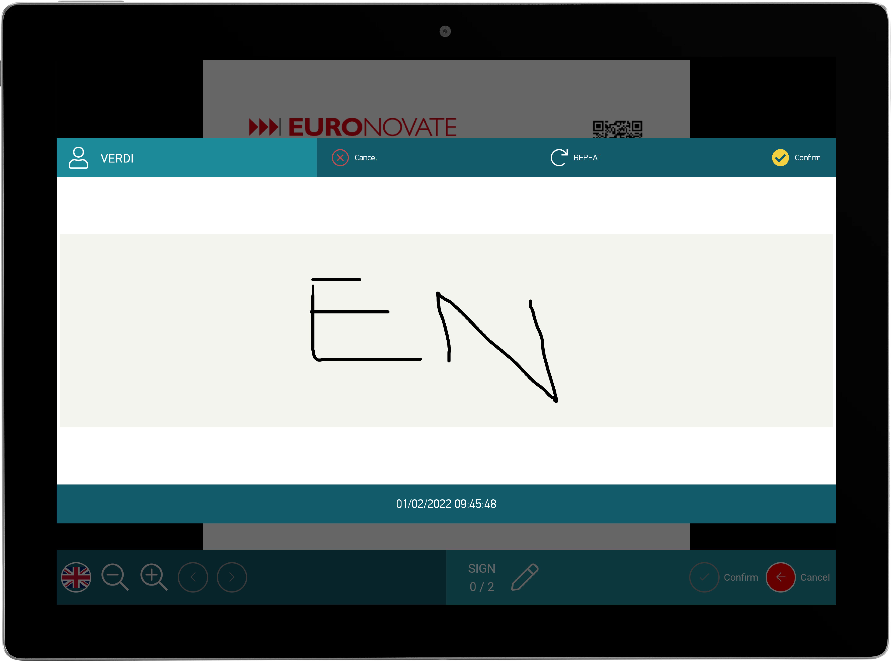

# ENSignatureBox

## Table of Contents
1. [Gradle Dependency](#gradle-dependency)
2. [Basics](#basics)
3. [ENSignatureBoxConfig](#ENSignatureBoxConfig)
4. [ENSignatureBoxActions](#ENSignatureBoxActions)
5. [ENSignatureBoxTheme](#ENSignatureBoxTheme)

## Gradle Dependency


#### [SignatureBox Tutorial and Samples](signaturebox/readme.md)



The `SignatureBox` module allow to capture finger digital signature or stylus digital signature in specific popup/dialog called `ENSignatureActivity `. The signature can be with or not biometricdata with `ENBio`

```gradle
dependencies {
	implementation "com.euronovate.signaturebox:signaturebox:1.0.0"
}
```

## Basics

Here's a very basic example of inizialization of ENSignatureBoxLibrary in ENMobileSdk builder. You have to do this operation once time because we keep istance of each modules.

```kotlin
 .with(ENSignatureBox.Builder()
      .with(applicationContext = applicationContext)
      .with(signatureBoxConfig = ENSignatureBoxConfig(useAlpha = true,
                    signatureSourceType = ENSignatureSourceType.Any,
                    signatureContentMode = ENSignatureContentMode.keepFieldRatio,
                    signatureImageConfig = ENSignatureImageConfig.signatureSignerNameAndTimestamp))
       .build())
```
You have to **respect** *.with* order like in above example.


## ENSignatureBoxConfig

This is a class that allow to config this module.

```kotlin
 ENSignatureBoxConfig(
    var signatureSourceType: ENSignatureSourceType?,
    var useAlpha: Boolean,
    var signatureImageConfig: ENSignatureImageConfig = ENSignatureImageConfig.justSignature,
    var signatureContentMode: ENSignatureContentMode = ENSignatureContentMode.keepFieldRatio
)
```
`signatureSourceType` you can choice with sourceType you will draw signature, you have this options:

*  `Pen` 
*  `Finger`
*  `Any` --> in this case we select first method when you draw first line/dot


`useAlpha` if this parameter is set to true, the image return in signaturebox on confirm will be with background **trasparent** (like a png) if set a false bg will be **white** (like a jpg)

`signatureImageConfig` you can customize label over signature (SignerName + timestamp), if you want can be without this info. Options are:

* `justSignature` -> no label
* `signatureAndSignerName` -> only signer name
* `signatureAndTimestamp`, -> only timestamp
* `signatureSignerNameAndTimestamp` -> both signer and timestamp

another customization about signature image with this config: `signatureContentMode `. This paramter is used to **fit** or **fill** signatureField in pdf, we have options:

* `ignoreFieldRatio`,
* `keepFieldRatio`

## ENSignatureBoxActions

**Show**

```kotlin
ENSignatureBox.getInstance().show(activity: Activity, 
	pdfContainer: PdfContainer, signatureFieldName: String,
	callback: (ENSignatureBoxResponse<ENSignatureDataResult>)->Unit)
```
to open signatureBox you need to pass:

`activity` -> current activity.

`pdfContainer` -> structure obtained after **processing** of document in `ENPdfMiddleware`

`signatureFieldName` -> this is unique identify of signatureField in a document.

`callback` -> used to notify user after confirmation a signature drawed. You will receive this object: `ENSignatureDataResult` and this is the class declaration

```kotlin
class ENSignatureDataResult {
    var bioData: String? = null
    var signatureImage: String?= null
    var signatureModel: SignatureModel? = null
    var hasAlpha: Boolean? = false
}
```

`bioData` -> is base64 of biometric data xml crypted
`signatureImage` -> is base64 of image
`signatureModel` -> is class with all info field just signed.
`hasAlpha` -> boolean that indicates if `signatureImage` is with bg white or trasparent


**isSignatureBox is visible**

If you want to check if signatureBox is alreadyVisible.  `return Bool`

```kotlin
ENSignatureBox.getInstance().isAlreadyVisible() 

```

## ENSignatureBoxTheme

You can customize your ENSignatureBox with this code:

```kotlin
class ENDefaultSignatureBoxTheme: ENSignatureBoxTheme(){
    override fun userIcon(): ENUIViewStyle {
        val context = ENMobileSDK.getInstance().applicationContext
        return ENUIViewStyle(srcImage = R.drawable.ic_people,tintColor = context.getColor(R.color.white))
    }

    override fun userText(): ENUIViewStyle {
        val context = ENMobileSDK.getInstance().applicationContext
        return ENUIViewStyle( textColor = context.getColor(R.color.white),
            textSize = 20f,textTypeface = null)
    }

    override fun userContainer(): ENUIViewStyle {
        val context = ENMobileSDK.getInstance().applicationContext
        return ENUIViewStyle(bgColor = context.getColor(R.color.bguserinfosignaturebox))
    }
    override fun repeatIcon(): ENUIViewStyle {
        val context = ENMobileSDK.getInstance().applicationContext
        return ENUIViewStyle(srcImage = R.drawable.ic_repeat,tintColor = context.getColor(R.color.white),
            textColor = context.getColor(R.color.white), textSize = 23f,textTypeface = font().light())
    }

    override fun signatureContainer(): ENUIViewStyle {
        val context = ENMobileSDK.getInstance().applicationContext
        return ENUIViewStyle(bgColor = context.getColor(R.color.signatureColor))
    }

    override fun timeStampText(): ENUIViewStyle {
        val context = ENMobileSDK.getInstance().applicationContext
        return ENUIViewStyle( textColor = context.getColor(R.color.white), textSize = 20f,textTypeface = font().light())
    }

    override fun font(): ENFont {
        return ENDefaultFont()
    }

    override fun confirmIcon(): ENUIViewStyle {
        val context = ENMobileSDK.getInstance().applicationContext
        return ENUIViewStyle(srcImage = R.drawable.ic_done,tintColor = context.getColor(R.color.yellow),
            textColor = context.getColor(R.color.white), textSize = 23f,textTypeface = font().light())
    }

    override fun abortIcon(): ENUIViewStyle {
        val context = ENMobileSDK.getInstance().applicationContext
        return ENUIViewStyle(srcImage = R.drawable.ic_abort,tintColor = context.getColor(R.color.redsemidark),
            textColor = context.getColor(R.color.white), textSize = 23f,textTypeface = font().light())
    }

    override fun topContainer(): ENUIViewStyle {
        val context = ENMobileSDK.getInstance().applicationContext
        return ENUIViewStyle(bgColor = context.getColor(R.color.titletextprogressdialog))
    }

    override fun bottomContainer(): ENUIViewStyle {
        val context = ENMobileSDK.getInstance().applicationContext
        return ENUIViewStyle(bgColor = context.getColor(R.color.titletextprogressdialog))
    }


	override fun watermarkSigner(): ENUIViewStyle {  
	    val context = ENMobileSDK.getInstance().applicationContext  
		return ENUIViewStyle( textColor = context.getColor(R.color.waterMarkTextColor), textTypeface = font().medium())  
	}  
  
	override fun watermarkTimeStamp(): ENUIViewStyle {  
	     val context = ENMobileSDK.getInstance().applicationContext  
		 return ENUIViewStyle( textColor = context.getColor(R.color.waterMarkTextColor), textTypeface = font().regular())  
	}
}
```

You can customize in signatureboxDialog:

-label style `signerName`
-label/layout button: `confirm`, `cancel`, `repeat`
-label: `timestamp`
-background: `signatureArea`

And in final signatureImage it is possibile personalize: 

-`watermarkSigner` -> textColor, textTypeface(font)
-`watermarkTimestamp` -> textColor and textTypeface

Watermark is text below  `signature image`  after acquiring the signature from the user, in the `ENSignatureBoxConfig.signatureImageConfig`  you can change which text you would show


