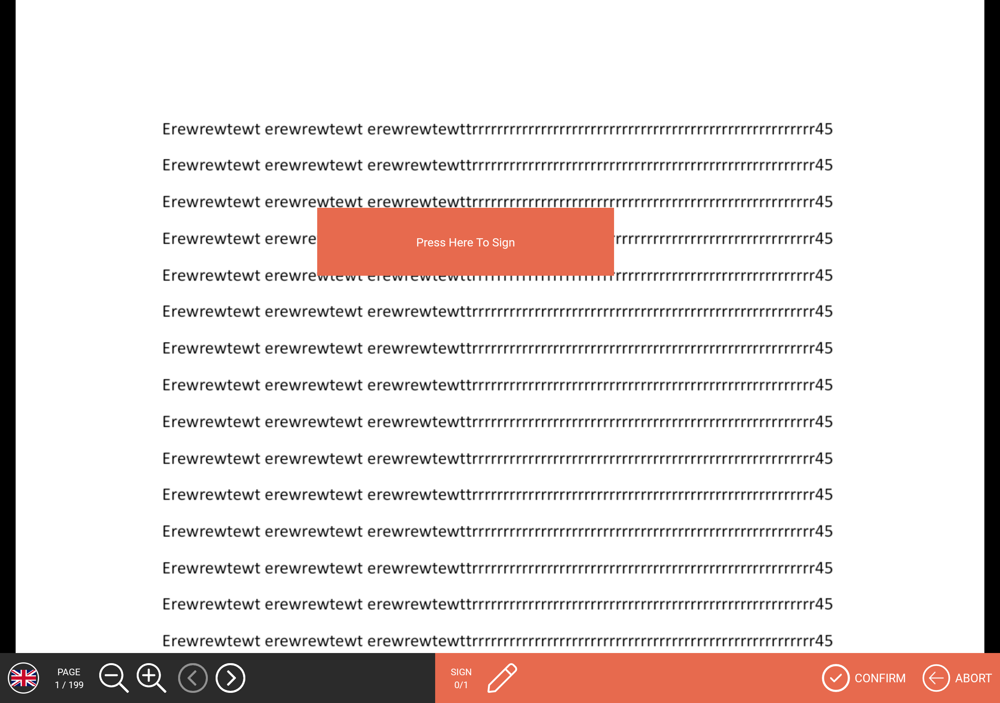

# ENViewer

## Table of Contents
1. [Gradle Dependency](#gradle-dependency)
2. [Basics](#basics)
3. [ENViewerConfig](#ENViewerConfig)
4. [ENViewerActions](#ENViewerActions)
5. [ENViewerTheme](#ENViewerTheme)
6. [Style](#Style) 

## Gradle Dependency

)


The `viewer` module contains extensions to the core module, such as a document (pdf) rendering and all actions handling on acrofields

```gradle
dependencies {
 	implementation "com.euronovate.viewer:viewer:1.2.0"
}
```

## Basics

Here's a very basic example of inizialization of ENViewer in ENMobileSdk builder. You have to do this operation once time because we keep istance of each modules.

```kotlin
.with(ENViewer.Builder()  
    .with(ENViewerConfig(signFieldPlaceholder = ENSignFieldPlaceholder.defaultPlaceholder(),  
    viewerType = ENViewerType.simple, viewerBarType = ENViewerBarType.simple))  
    .build())
```
Must **respect** *.with* order like in above example.


## ENViewerConfig
There is a config in builder of viewer module. This is the constructor:

```kotlin
class ENViewerConfig(val signFieldPlaceholder: ENSignFieldPlaceholder,  
                     var idleTimeout: Long?=null,  
                     var viewerType: ENViewerType?=ENViewerType.simple,  
                     var viewerBarType: ENViewerBarType?=ENViewerBarType.simple)
```

### ENSignFieldPlaceholder
`signFieldPlaceholder` is mandatory and it used to customize placeholder in signatureField you can choiche this options:

- **signerName** -> if you want show signerName that will sign this field
- **defaultPlaceholder** -> this is the default placeholder, this is the text: Press Here To Sign
- **customPlaceholder**: -> you can write custom text


### IdleTimeout
`idleTimeout`: if configured it will allow to close viewer in case of idle after X seconds.

### ENViewerType

`viewerType` is an enum with these options:

- `simple`: is default layout


- `theme1`: is another type of layout with 2 bars: leftBar fixed in this position and bottombar (**ENTwiceBar**) with two options confirm and cancel.


**bottombar**: you can customize it with theme


### ENViewerBarType
`viewerBarType` is another that allow to customize viewerBar we have these options:

`simple` : in this case it has confirm and cancel buttons


`theme1`:  in this case (image is rotated) it hasn't confirm and cancel buttons.


Size of icon is customizable with an override of `dimen` styles we will explain in theme chapter

## ENViewerActions

```kotlin
ENViewer.getInstance().start(pdfContainer: PdfContainer)

```
to open viewer with `pdfContainer`. 

```kotlin
ENViewer.getInstance().isAlreadyVisible() 
```
If you want to check if viewer is alreadyVisible. (it also consider signaturebox over viewer). `return Bool`

### ENMobileSDK Extensions

When user adds in your app this module, automatically he will find himself in `ENMobileSdk.getInstance()` this methods:

**OPEN LOCAL DOCUMENT **

```kotlin
ENMobileSDK.openDocument(documentBase64: String, certPemBase64: String?=null): Boolean
```
You can use this method to open a document local in `base64`, and you can also pass `pem` used to crypt ***biometricData***. It is optional because we support too only ***graphometric signature***

Exist another similar method to open document with byte array.

```kotlin
ENMobileSDK.openDocument(data : ByteArray,certPemBase64: String?=null): Boolean
```

**OPEN  REMOTE DOCUMENT**

```kotlin
suspend fun ENMobileSDK.openRemoteDocument(documentGuid: String): Boolean
```
Use this method to open document with *`guid`*. 

As you can see from code this request is suspend, so you need to call in couroutine, because we use **IO** interaction over **Network**

If you want handle `ENSoftServerException` or other type you have to use `try / catch `

## ENViewerTheme

This is an example of initialization of ENViewerTheme:

```kotlin
class ENDefaultViewerTheme: ENViewerTheme(){  
    override fun viewerSimpleTheme(): ENViewerSimpleTheme {  
        return ENDefaultViewerSimpleTheme()  
    }  
  
    override fun viewerTheme1(): ENViewerTheme1 {  
       return ENDefaultViewerTheme1()  
    }  
}
```

You have to **override** only method based on the chosen theme.

### ENViewerSimpleTheme

This is an example of initialization of `ENViewerSimpleTheme`:

```kotlin
class ENDefaultViewerSimpleTheme: ENViewerSimpleTheme(){  
    override fun viewerBarTheme(): ENViewerBarSimpleTheme {  
        return ENDefaultViewerBarSimpleTheme()  
    }  
}
```


At this moment with this theme you can customize:

- `viewerBarTheme` -> this is the ui component rendered above document viewer


### ENViewerBarSimpleTheme

Right away you can find an example of bottombar "customized":


```kotlin
class ENDefaultViewerBarSimpleTheme: ENViewerBarSimpleTheme(){  
    override fun leftLayout(): ENUIViewStyle {  
        return ENUIViewStyle(bgColor = ENMobileSDK.getInstance().applicationContext.getColor(R.color.bgcolordialog))  
    }  
  
    override fun flagCountry(): ENUIViewStyle {  
        return ENUIViewStyle(borderWidth = 5, borderColor = ENMobileSDK.getInstance().applicationContext.getColor(R.color.white),  
        cornerRadius = 40)  
    }  
  
    override fun pageInfo(): ENUIViewStyle {  
        return ENUIViewStyle(textSize = 12f, textColor = ENMobileSDK.getInstance().applicationContext.getColor(R.color.white),  
            textTypeface = font().regular())  
    }  
  
    override fun pageCounter(): ENUIViewStyle {  
        return ENUIViewStyle(textSize = 12f, textColor = ENMobileSDK.getInstance().applicationContext.getColor(R.color.white),  
            textTypeface = font().regular())  
    }  
    override fun zoomIn(): ENUIViewStyle {  
        return ENUIViewStyle(srcImage = R.drawable.zoom_in_selector)  
    }  
  
    override fun zoomOut(): ENUIViewStyle {  
        return ENUIViewStyle(srcImage = R.drawable.zoom_out_selector)  
    }  
  
    override fun previousPage(): ENUIViewStyle {  
        return ENUIViewStyle(srcImage = R.drawable.ic_previous_page_selector)  
    }  
  
    override fun nextPage(): ENUIViewStyle {  
        return ENUIViewStyle(srcImage = R.drawable.ic_next_page_selector)  
    }  
  
    override fun rightLayout(): ENUIViewStyle {  
        return ENUIViewStyle(bgColor = ENMobileSDK.getInstance().applicationContext.getColor(R.color.bguserinfosignaturebox))  
    }  
  
    override fun signInfo(): ENUIViewStyle {  
        return ENUIViewStyle(textSize = 12f, textColor = ENMobileSDK.getInstance().applicationContext.getColor(R.color.white),  
        textTypeface =  font().regular())  
    }  
  
    override fun signCounter(): ENUIViewStyle {  
        return ENUIViewStyle(textSize = 12f, textColor = ENMobileSDK.getInstance().applicationContext.getColor(R.color.white),  
            textTypeface =  font().regular())  
    }  
  
    override fun sign(): ENUIViewStyle {  
        return ENUIViewStyle(srcImage = R.drawable.ic_pen_light_selector)  
    }  
  
    override fun confirmIcon(): ENUIViewStyle {  
        return ENUIViewStyle(srcImage = R.drawable.ic_circle_done_empty_selector)  
    }  
  
    override fun confirmLabel(): ENUIViewStyle {  
        return ENUIViewStyle(textColor = ENMobileSDK.getInstance().applicationContext.getColor(R.color.white),  
        textTypeface = font().regular())  
    }  
  
    override fun abortIcon(): ENUIViewStyle {  
        return ENUIViewStyle(srcImage = R.drawable.ic_circle_abort_selector)  
    }  
    override fun abortLabel(): ENUIViewStyle {  
        return ENUIViewStyle(textColor = ENMobileSDK.getInstance().applicationContext.getColor(R.color.white),  
            textTypeface = font().regular())  
    }  
    override fun font(): ENFont {  
        return ENDefaultFont()  
    }  
    override fun versionLabel(): ENUIViewStyle {  
	    return ENUIViewStyle(textSize = 15f, textColor = ENMobileSDK.getInstance().applicationContext.getColor(R.color.white),  
        textTypeface =  font().regular())  
	}  
	override fun versionValue(): ENUIViewStyle {  
	    return ENUIViewStyle(textSize = 12f, textColor = ENMobileSDK.getInstance().applicationContext.getColor(R.color.white),  
        textTypeface =  font().regular())  
	}
}
```

### ENViewerTheme1

Here an example of init ENViewerTheme1 class:

```kotlin
class ENDefaultViewerTheme1: ENViewerTheme1(){  
    override fun viewerBarTheme(): ENViewerBarTheme1 {  
        return ENDefaultViewerBarTheme1()  
    }  
    override fun bottomBarTheme(): ENTwiceBarTheme {  
        return ENDefaultTwiceBarViewerTheme()  
    }  
}
```
You have to override:

### ENViewerBarTheme1

This is an example of initialization of `ENDefaultViewerBarTheme1`

```kotlin
class ENDefaultViewerBarTheme1: ENViewerBarTheme1(){  
    override fun leftLayout(): ENUIViewStyle {  
        return ENUIViewStyle(bgColor = ENMobileSDK.getInstance().applicationContext.getColor(R.color.bgcolordialog))  
    }  
  
    override fun flagCountry(): ENUIViewStyle {  
        return ENUIViewStyle(borderWidth = 5, borderColor = ENMobileSDK.getInstance().applicationContext.getColor(R.color.white),  
            cornerRadius = 40)  
    }  
  
    override fun pageInfo(): ENUIViewStyle {  
        return ENUIViewStyle(textSize = 12f, textColor = ENMobileSDK.getInstance().applicationContext.getColor(R.color.white),  
            textTypeface = font().regular())  
    }  
  
    override fun pageCounter(): ENUIViewStyle {  
        return ENUIViewStyle(textSize = 12f, textColor = ENMobileSDK.getInstance().applicationContext.getColor(R.color.white),  
            textTypeface = font().regular())  
    }  
  
    override fun zoomIn(): ENUIViewStyle {  
        return ENUIViewStyle(srcImage = R.drawable.zoom_in_selector)  
    }  
  
    override fun zoomOut(): ENUIViewStyle {  
        return ENUIViewStyle(srcImage = R.drawable.zoom_out_selector)  
    }  
  
    override fun previousPage(): ENUIViewStyle {  
        return ENUIViewStyle(srcImage = R.drawable.ic_previous_page_selector)  
    }  
  
    override fun nextPage(): ENUIViewStyle {  
        return ENUIViewStyle(srcImage = R.drawable.ic_next_page_selector)  
    }  
  
    override fun rightLayout(): ENUIViewStyle {  
        return ENUIViewStyle(bgColor = ENMobileSDK.getInstance().applicationContext.getColor(R.color.bguserinfosignaturebox))  
    }  
  
    override fun signInfo(): ENUIViewStyle {  
        return ENUIViewStyle(textSize = 12f, textColor = ENMobileSDK.getInstance().applicationContext.getColor(R.color.white),  
            textTypeface =  font().regular())  
    }  
  
    override fun signCounter(): ENUIViewStyle {  
        return ENUIViewStyle(textSize = 20f, textColor = ENMobileSDK.getInstance().applicationContext.getColor(R.color.white),  
            textTypeface =  font().regular())  
    }  
  
    override fun sign(): ENUIViewStyle {  
        return ENUIViewStyle(srcImage = R.drawable.ic_pen_light_selector)  
    }  
  
    override fun font(): ENFont {  
        return ENDefaultFont()  
    }  
	override fun versionLabel(): ENUIViewStyle {  
	    return ENUIViewStyle(textSize = 19f, textColor = ENMobileSDK.getInstance().applicationContext.getColor(R.color.white),  
        textTypeface =  font().regular())  
	}  
  
	override fun versionValue(): ENUIViewStyle {  
	    return ENUIViewStyle(textSize = 15f, textColor = ENMobileSDK.getInstance().applicationContext.getColor(R.color.white),  
        textTypeface =  font().regular())  
	}
}
```

it is similar to that `ENViewerBarSimpleTheme` but it hasn't confirm,cancel button because you need to override `ENTwiceBarTheme`

### ENTwiceBarTheme

Here an example of initialization:

```kotlin
class ENDefaultTwiceBarViewerTheme: ENTwiceBarTheme(){  
    override fun confirm(): ENUIViewStyle {  
        return ENUIViewStyle(bgDrawableRes = R.drawable.bg_confirm_bar, srcImage = R.drawable.ic_circle_done_empty_selector,  
        textColorSelector = R.color.text_white_enable_gray_disable, textSize = 35f)  
    }  
    override fun abort(): ENUIViewStyle {  
        return ENUIViewStyle(bgDrawableRes = R.drawable.bg_cancel_bar, srcImage = R.drawable.ic_circle_cancel_empty_selector,  
            textColorSelector = R.color.text_white_enable_gray_disable, textSize = 35f)  
    }  
}
```
With this theme you can customize only two button:
-abort (right)
-confirm (left)


## Style

### Dimens `style` 

At this moment we have this style variables, that you can override:

```xml
<?xml version="1.0" encoding="utf-8"?>  
<resources>  
    <dimen name="viewerBarTheme1_width">90dp</dimen>  
    <dimen name="twiceBarTheme1_height">90dp</dimen>  
  
    <!-- generic theme -->  
    <dimen name="viewerCountrySelector_width_height">40dp</dimen>  
    <!-- theme 1 -->  
    <dimen name="iconViewerBarTheme1_width_height">55dp</dimen>  
    <!-- simple theme -->  
    <dimen name="viewerBarSimple_width_or_height">@dimen/abc_action_bar_default_height_material</dimen>  
    <dimen name="iconViewerBarSimple_width_height">38dp</dimen>  
</resources>
```
They are used to set `Width` & `Height` of:

- icons
- country selector
- layout viewerBar
- layout twicebar(bottombar)