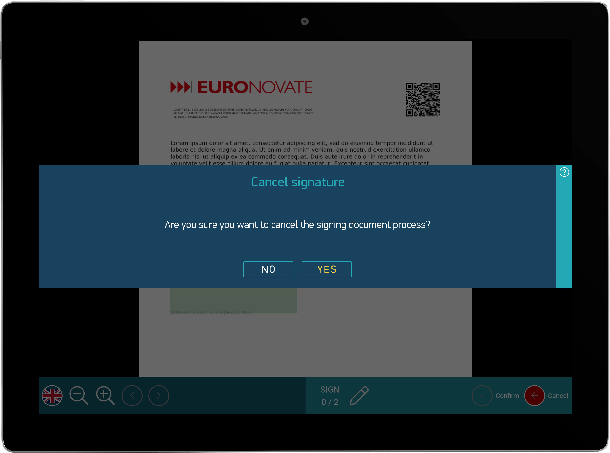
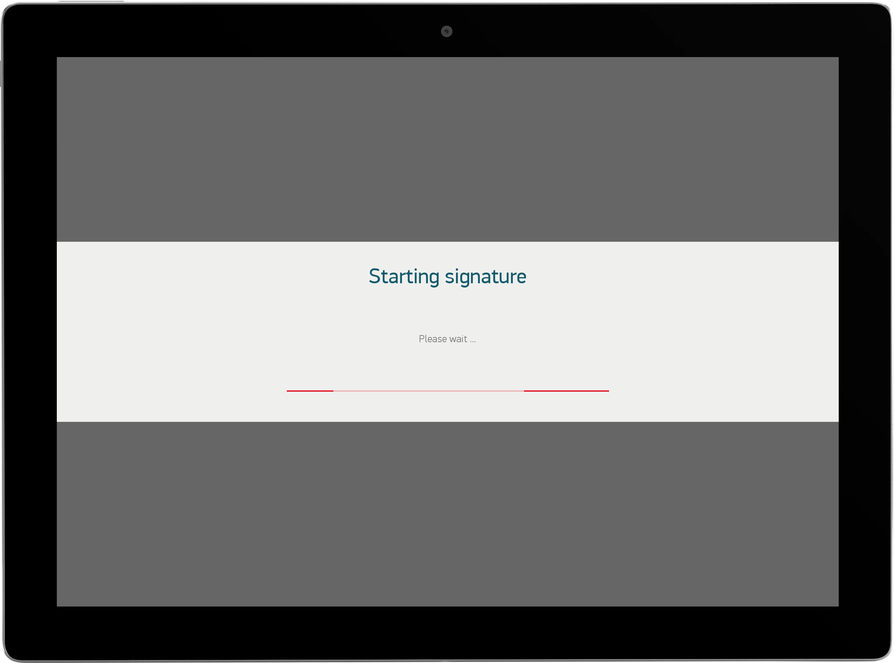
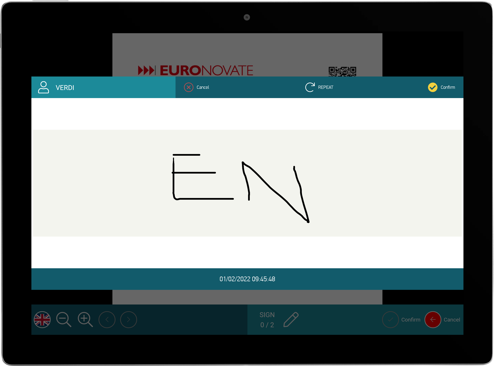

# ENMobileSDK

#### [View Releases and Changelogs](https://github.com/euronovate/mobilesdk_android/releases)

[](https://opensource.org/licenses/Apache-2.0)

---


# Modules

The core module is the fundamental module that you need in order to use this library.

Please note that ENMobileSDK, this library only supports Kotlin.

## Core


The `core` module contains everything you need to get started with the library. It contains all
core and:

* utilities
* logger
* enauth
* endialog
* ensettings

The `ENAuth` is liable to check license and active all modules `built` with ENMobileSdk

The `ENDialog` contains a set of dialog type that you can use in your app and it is already used in sdk






```gradle
dependencies {
  implementation 'com.euronovate.mobilesdk:core:1.0.0'
}
```

## ENViewer


#### [Viewer Tutorial and Samples](viewer/readme.md)


 
The `viewer` module contains extensions to the core module, such as a document (pdf) rendering and all actions handling with acrofields for example:

* textfield
* checkbox
* radiobutton
* signature

```gradle
dependencies {
 	implementation "com.euronovate.viewer:viewer:1.0.0"
}
```
 
## ENDigitalSignage


#### [DigitalSignage Tutorial and Samples](digitalsignage/readme.md)


The `digitalsignage` module contains a module with a main actity called `ENDigitalSignageActivity` that allow to have a slideshow with video/image in loop in waiting for a new document to sign/edit

```gradle
dependencies {
  implementation "com.euronovate.digitalsignage:digitalsignage:1.0.0"
}
```

## ENPdfMiddleware


#### [PdfMiddleware Tutorial and Samples](PdfMiddleware/readme.md)

The `pdfMiddleware` module contains an extension of core and it is a brain of the processing about pdf Document for example:

* elaborate bookmarks
* signPdf
* apposeCheckbox
* apposeRadioButton
* apposeTextField

```gradle
dependencies {
    implementation "com.euronovate.pdfmiddleware:pdfMiddleware:1.0.0"
}
```

## ENPresenter


#### [Presenter Tutorial and Samples](presenter/readme.md)

The `presenter` module contains only a template used by `viewer` to render document. It is customized based on client.

```gradle
dependencies {
    implementation "com.euronovate.presenter:presenter:1.0.0"
}
```

## ENPubSub


#### [PubSub Tutorial and Samples](pubsub/readme.md)

The `PubSub ` module allow to estabilish a connection with websocket in particual with these types of ws:

* signalR
* WebSocket


```gradle
dependencies {
    implementation "com.euronovate.pubsub:pubsub:1.0.0"
}
```

## ENSignatureBox


#### [SignatureBox Tutorial and Samples](signaturebox/readme.md)



The `SignatureBox` module allow to capture finger digital signature or stylus digital signature in specific popup/dialog called `ENSignatureActivity `. The signature can be with or not biometricdata with `ENBio`

```gradle
dependencies {
	implementation "com.euronovate.signaturebox:signaturebox:1.0.0"
}
```

## ENBioLibrary


#### [BioLibrary Tutorial and Samples](biolibrary/readme.md)

The `BioLibrary` module allow to collect all biometric data while you are signing document. We collect `x` `y` and `pressure` , `timestamp` etc. All data are crypted and in base64.

```gradle
dependencies {
  implementation "com.euronovate.bio:bio:1.0.0"
}
```

## ENSoftServer


#### [SoftServer Tutorial and Samples](softserver/readme.md)

The `SoftServer` contains all api request used to interact with document, for example:

* find document
* download
* update status document
* signPdf
* appose Checkbox, TextField, RadioButton

```gradle
dependencies {
  implementation "com.euronovate.softserver:softserver:1.0.0"
}
```