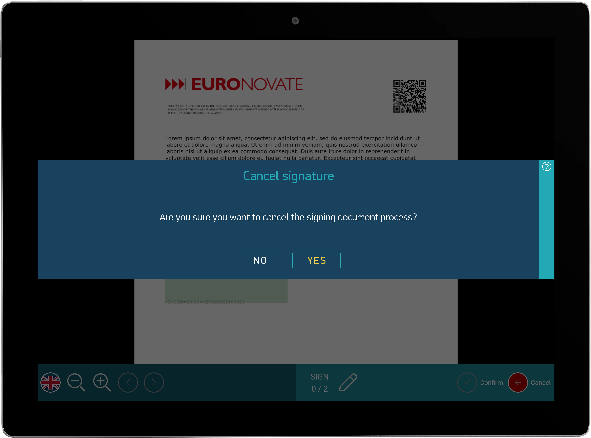
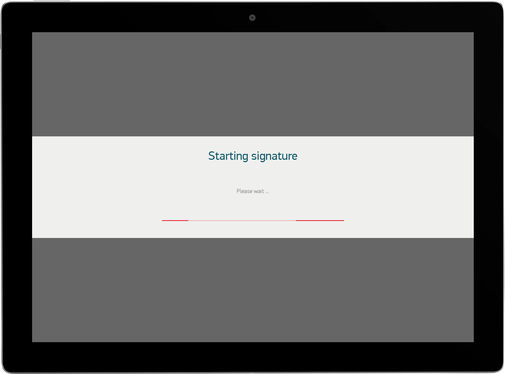
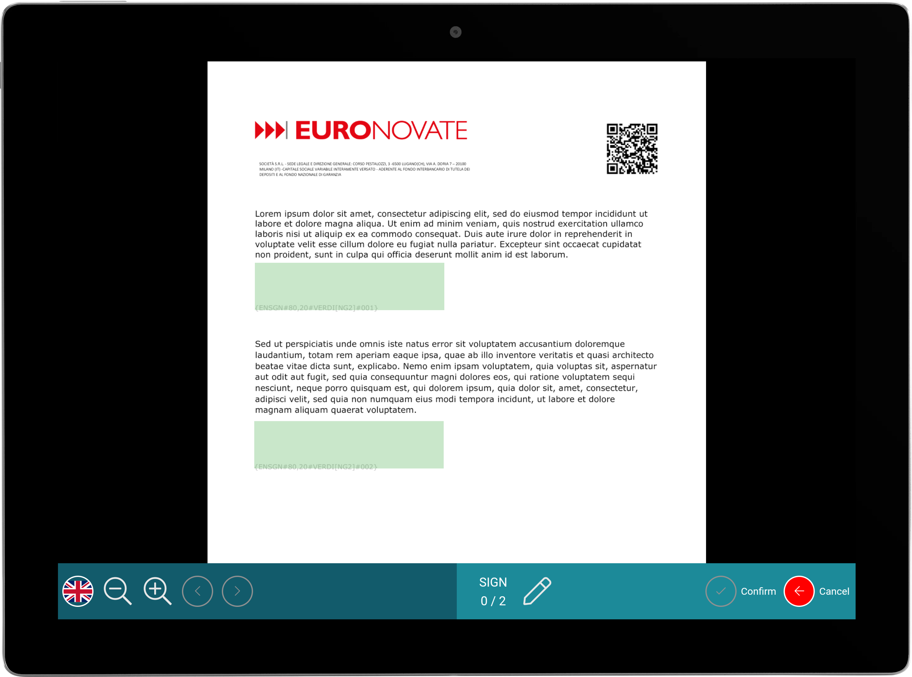
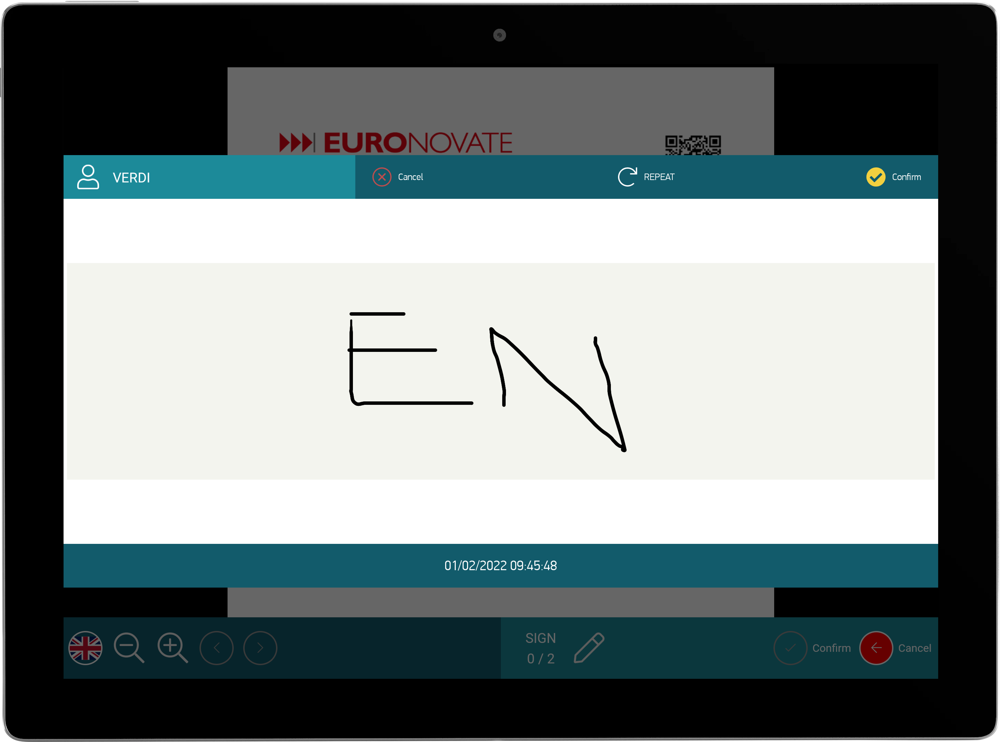

# ENMobileSDK

#### [View Releases and Changelogs](https://github.com/euronovate/ENMobileSDK-Android/releases)

[](https://opensource.org/licenses/Apache-2.0)

---

# Modules

The core module is the fundamental module that you need in order to use this sdk.

Please note that ENMobileSDK, this library only full supports Kotlin, buy maybe work with Java

### Maven Gradle Dependecy Setup
Before start you need to setup maven repositories:

You have to put in your external file `build.gradle`

this: 

```gradle
maven {
	url "https://dev.euronovate.com:9802/artifactory/android-release-local"
}
```

In the most recent project of gradle / android-studio, you have to set this in `settings.gradle`

### Gradle Dependecies required

Our sdk use a set of dependecies that they are required, this is a list:

```gradle
  implementation 'com.google.code.gson:gson:2.8.7'
  implementation 'androidx.preference:preference-ktx:1.1.1'
  implementation 'com.vmadalin:easypermissions-ktx:1.0.0'
  implementation 'androidx.exifinterface:exifinterface:1.3.2'

  //Database room
  implementation("androidx.room:room-runtime:$roomVersion")
  kapt("androidx.room:room-compiler:$roomVersion")
  implementation("androidx.room:room-ktx:$roomVersion")
  
  //lifecycle
  implementation "android.arch.lifecycle:extensions:1.1.1"
  implementation "androidx.lifecycle:lifecycle-runtime:2.0.0"
  implementation "androidx.lifecycle:lifecycle-extensions:2.0.0"
  annotationProcessor "androidx.lifecycle:lifecycle-compiler:2.0.0"
  
   // crypto
  implementation "org.bouncycastle:bcprov-jdk15on:1.61"
  implementation "org.bouncycastle:bcpkix-jdk15on:1.61"
  
  //API okhttp
  implementation "com.squareup.okhttp3:okhttp:4.7.2"
  implementation "com.squareup.okhttp3:logging-interceptor:4.7.2"
  implementation 'org.conscrypt:conscrypt-android:2.2.1'
  
  //GLIDE
  api 'com.github.bumptech.glide:glide:4.12.0'
  annotationProcessor 'com.github.bumptech.glide:compiler:4.12.0'
  
  //LOGGING
  implementation "org.slf4j:slf4j-simple:1.6.1"
  //IO
  implementation 'org.simpleframework:simple-xml:2.7.1'
  api 'io.jsonwebtoken:jjwt-api:0.10.7'
  runtimeOnly 'io.jsonwebtoken:jjwt-impl:0.10.7'
  runtimeOnly('io.jsonwebtoken:jjwt-orgjson:0.10.7') {
       exclude group: 'org.json', module: 'json'
  }
  ```

You have to put this list in your `app/build.gradle` 

To use plugins kapt for **database room** is necessary add this plugin on top of `app/build.gradle` 

```gradle
id 'kotlin-kapt'
```

Full example like this:

```gradle
plugins {
    id 'com.android.application'
    id 'kotlin-android'
    id 'kotlin-kapt'
}
```

## ENMobileSDK (conventionally ENCore)


The `core` module includes everything you need to get started with the library. It contains all core and:
* utilities
* logger
* enauth
* endialog
* ensettings

The `ENAuth` is liable to check license and to activate all modules `built` with ENMobileSdk

The `ENDialog` contains a set of dialog type that you can use in your app and it is already used in sdk






```gradle
dependencies {
  implementation 'com.euronovate.mobilesdk:core:1.0.0'
}
```

## ENViewer


#### [Viewer Tutorial and Samples](ENViewer/readme.md)


 
The `viewer` module contains extensions to the core module, such as a document (pdf) rendering and all actions handling with acrofields for example:

* textfield
* checkbox
* radiobutton
* signature

```gradle
dependencies {
 	implementation "com.euronovate.viewer:viewer:1.0.0"
}
```
 
## ENDigitalSignage


#### [DigitalSignage Tutorial and Samples](ENDigitalSignage/readme.md)


The `digitalsignage` module contains a main activity `ENDigitalSignageActivity` that allow to have a slideshow with video/image in loop in waiting for a new document to sign/edit

```gradle
dependencies {
  implementation "com.euronovate.digitalsignage:digitalsignage:1.0.0"
}
```

## ENPdfMiddleware


#### [ENPdfMiddleware Tutorial and Samples](ENPdfMiddleware/readme.md)

The `pdfMiddleware` is an extension of the core and it is a brain of the processing about pdf Document, for example:

* elaborate bookmarks
* signPdf
* apposeCheckbox
* apposeRadioButton
* apposeTextField

```gradle
dependencies {
    implementation "com.euronovate.pdfmiddleware:pdfMiddleware:1.0.0"
}
```

## ENPresenter


#### [ENPresenter Tutorial and Samples](ENPresenter/readme.md)

The `presenter` module contains only a templates used by `viewer` to render document. It is customized based on client.

```gradle
dependencies {
    implementation "com.euronovate.presenter:presenter:1.0.0"
}
```

## ENPubSub


#### [ENPubSub Tutorial and Samples](ENPubSub/readme.md)

The `PubSub ` module allow to estabilish a connection with websocket in particual with these types of ws:

* signalR
* WebSocket


```gradle
dependencies {
    implementation "com.euronovate.pubsub:pubsub:1.0.0"
}
```

## ENSignatureBox


#### [SignatureBox Tutorial and Samples](ENSignatureBox/readme.md)



The `SignatureBox` module allow to capture finger or stylus digital signature, in specific popup/dialog called `ENSignatureActivity `. 
The signature can be with or not biometricdata with `ENBio`

```gradle
dependencies {
	implementation "com.euronovate.signaturebox:signaturebox:1.0.0"
}
```

## ENBioLibrary


#### [ENBioLibrary Tutorial and Samples](ENBioLibrary/readme.md)

The `BioLibrary` module allow to collect all biometric data while you are signing document. We collect `x` `y` and `pressure` , `timestamp` etc. All data are crypted and in base64.

```gradle
dependencies {
  implementation "com.euronovate.bio:bio:1.0.0"
}
```

## ENSoftServer


#### [ENSoftServer Tutorial and Samples](ENSoftServer/readme.md)

The `SoftServer` contains all api request used to interact with document, for example:

* find document
* download
* update status document
* signPdf
* appose Checkbox, TextField, RadioButton

```gradle
dependencies {
  implementation "com.euronovate.softserver:softserver:1.0.0"
}
```
